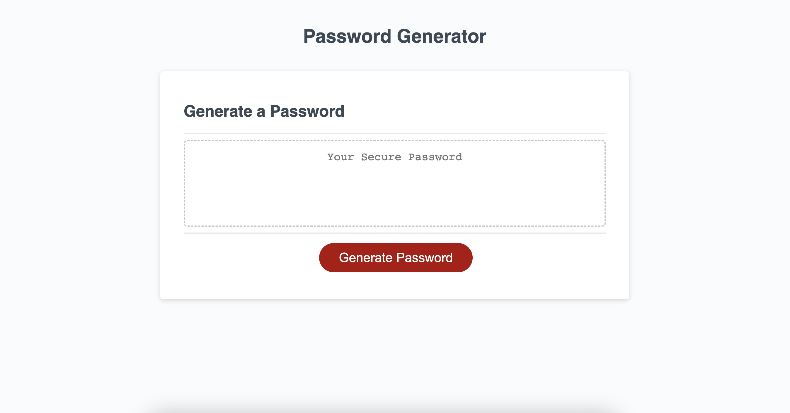

# portfolio

## Description

A website that can generate a random password with input from the user. 
Created with HTML, CSS, and Javascript.

## Installation

N/A

## Usage

Open [url](https://bnadel4.github.io/password-generator/) in web browser. Click the button to choose options with which to customize the generated password. The password must be between 8-128 characters in length and one charcter option must be chosen. After all prompts are answered a randomly generated password with the user choices applied will appear in the text area.

## Credits

N/A

## License

MIT License
